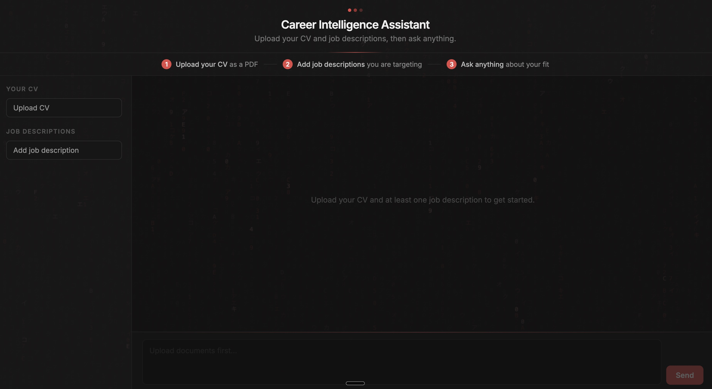
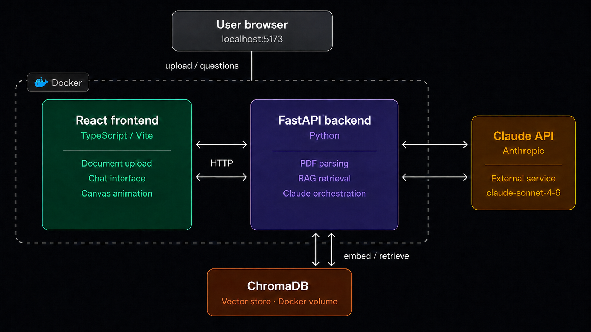

# Career Intelligence Assistant

## About the Project

Career Intelligence Assistant is an AI-powered career coaching tool. You upload your CV and one or more job descriptions, and the app analyses your fit using a RAG pipeline that retrieves relevant sections from your documents before the AI makes sense of it and gives you advice. Your documents must be in PDF format.

You can ask the chatbot anything: how your skills match a role, where the gaps are, and how to prepare for interviews.

Every fit analysis produces a match score out of 100. Scores of 60 and above come with a recommendation to apply, along with positioning advice and interview prep. Scores below 60 come with an honest breakdown of what is missing and what to work on before applying.




---

## Built With

| Layer | Technology |
|---|---|
| Backend | Python, FastAPI |
| Frontend | React, TypeScript, Vite |
| AI | Claude API (claude-sonnet-4-6) |
| Vector database | ChromaDB |
| Embeddings | all-MiniLM-L6-v2 via ONNX |
| Animation | HTML5 Canvas API |
| Containerisation | Docker, docker-compose |

---

## Quick Setup

### Prerequisites

- Docker Desktop installed and running
- Your own Anthropic API key from [platform.claude.com](https://platform.claude.com) with a payment card linked and funds credited (costs approximately $0.01 per message)
### Running locally

```bash
# Clone the repo
git clone https://github.com/kazthemaz/career-intelligence-assistant

# Go to the project directory
cd career-intelligence-assistant

# Copy the example environment file
cp .env.example .env

# Open .env and add your Anthropic API key
# ANTHROPIC_API_KEY=sk-ant-...

# Build and start the containers (first time only)
docker-compose up --build

# Subsequent starts (no rebuild needed)
docker-compose up

```
Open http://localhost:5173 in your browser.


---

## Architecture Overview




---

## What Would Be Required to Productionise

Replace locally hosted ChromaDB with a managed vector database, e.g. Pinecone, deploy the site to a cloud provider such as AWS. Make it such that users will not need their own API keys for AI and store it on AWS Secrets Manager. GDPR-compliant data handling due to people uploading their CVs and no persistent storage of their data. Add structured logging and monitoring so failures in the AI pipeline can be identified and diagnosed without user reports.

---

## RAG and LLM Approach and Decisions

Claude Sonnet was chosen as the LLM for its strong reasoning at a mid-range cost. ChromaDB with ONNX embeddings was chosen as the vector database to avoid a 9GB PyTorch dependency. Chunks started at 500 characters with 50 character overlap but were increased to 1500 characters with 200 character overlap after testing showed the smaller size gave Claude too little context to produce meaningful outputs. Retrieval queries each document individually by ID to ensure multiple job descriptions are always represented in the context. The system prompt acts as a behavioural guardrail preventing hallucination and score inflation and conversation history is maintained in memory for multi-turn chat. Observability is currently limited to logs inside the terminal.

---

## Key Technical Decisions

The most significant decisions were switching from sentence-transformers to ChromaDB's default ONNX embeddings to reduce the Docker image from 9GB to under 1GB and changing retrieval to query each document individually by ID after discovering that type-based retrieval only ever surfaced one job description when multiple were uploaded.

---

## Engineering Standards

Followed: feature branches, pull requests before merging, descriptive commit messages, inline comments, `.env` file never committed, secrets management, `.gitignore` covering secrets and meaningful variable and function names.

Skipped: automated tests due to time constraints. With more time I would add pytest for the backend endpoints and Vitest for the frontend components.

---

## How AI Tools Were Used

Claude was used as a pair programmer to generate boilerplate and query documentation and library patterns. Longer errors were shared with Claude to diagnose and areas of confusion were clarified through explanation. Architectural decisions were made independently.

---

## What I Would Do Differently With More Time

I would add semantic chunking on sentence boundaries and fine tune the chunking strategy to get a more optimised retrieval pipeline, as the fixes were made under time constraints that work but are not optimal. I would implement a golden dataset eval framework and process documents in memory rather than persisting them to improve user privacy. Due to time constraints, formal output guardrails and an eval harness were not implemented. Instead the system prompt was modified a few times and used to enforce output structure and prevent internal implementation details leaking to the user, which is a pragmatic workaround but not a production-grade solution.
